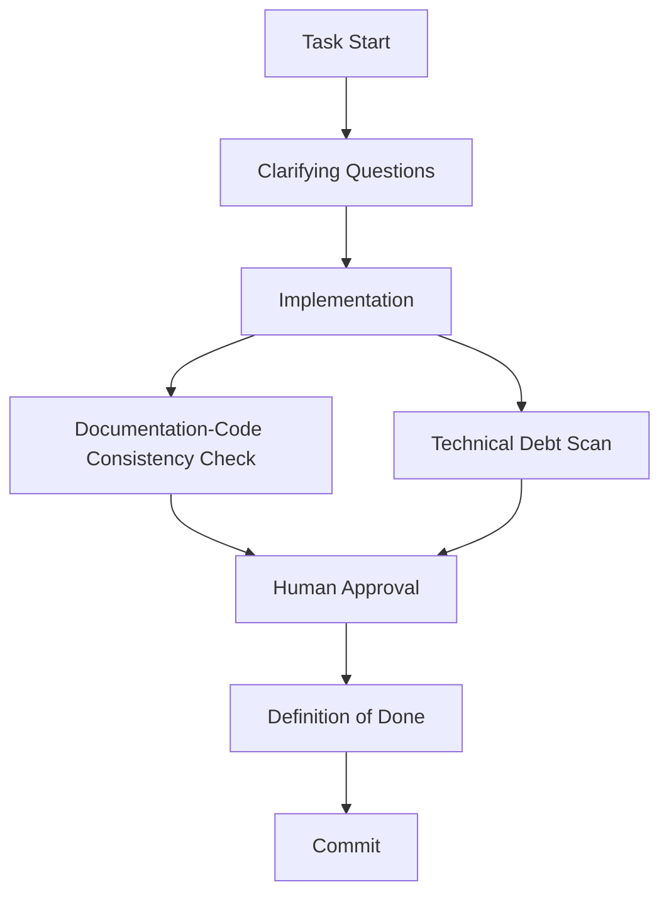

# Project Management Index

**AI: Start here.** This file is the single entry point for AI-assisted project management. Use it to find the right process and context for each task.

---

## Processes and When to Run

| Task | Process File | When to Run |
|------|--------------|-------------|
| Sprint planning | [sprint-planning-process.md](processes/sprint-planning-process.md) | Start of sprint, after retrospective |
| Sprint review | [sprint-review-process.md](processes/sprint-review-process.md) | End of sprint, before retrospective |
| Sprint retrospective | [sprint-retrospective-process.md](processes/sprint-retrospective-process.md) | End of sprint, after sprint review |
| Backlog refinement | [backlog-management-process.md](processes/backlog-management-process.md) | Weekly or bi-weekly |
| Documentation-Code Consistency + Technical Debt Identification Scan | [doc-code-consistency-process.md](processes/doc-code-consistency-process.md), [technical-debt-identification-process.md](processes/technical-debt-identification-process.md) | Before commit (AI-assisted work) |
| Release notes | [release-notes-process.md](processes/release-notes-process.md) | Each push/merge to main, end of sprint |
| Escalation | [escalation-process.md](processes/escalation-process.md) | When blockers or risks require escalation |

---

## Which File to Attach for Each Task

| Task | Attach These Files |
|------|-------------------|
| Sprint planning | `sprint-planning-process.md`, `product-backlog.md`, `sprint-planning-template.md` |
| Sprint review | `sprint-review-process.md`, active sprint document, `product-backlog.md` |
| Sprint retrospective | `sprint-retrospective-process.md`, active sprint document, `retrospective-template.md` |
| Create user story | `backlog-management-process.md`, `user-story-template.md` |
| Create defect | `backlog-management-process.md`, `defect-template.md` |
| Documentation-Code Consistency check | `doc-code-consistency-process.md`, `technical-debt-identification-process.md` |
| Release notes | `release-notes-process.md`, `release-note-section-template.md` |
| Refine backlog item | `backlog-management-process.md`, `product-backlog-structure.md`, `definition-of-ready.md` |

---

## Paths and Naming

| Type | ID Format | Path |
|------|-----------|------|
| User stories | US-XXX | `backlog/user-stories/US-XXX-*.md` |
| Defects | DEF-XXX | `backlog/defects/DEF-XXX-*.md` |
| Technical debt | TD-XXX | `backlog/technical-debt/TD-XXX-*.md` |
| Retrospective Improvements (from retrospectives) | RI-XXX | `backlog/retrospective-improvements/RI-XXX-*.md` |
| Architecture Decision Records | ADR-XXX | `architecture-decision-records/ADR-XXX-*.md` |
| Sprints | sprint-XX | `sprints/sprint-XX-*.md` |

---

## Pre-Commit Flow

For AI-assisted work, the flow before commit is:

1. **Documentation-Code Consistency Check** — AI compares code with documentation; generates gap report
2. **Technical Debt Scan** — AI identifies new technical debt from changes
3. **Human approval** — Human reviews report and decides what to update
4. **Definition of Done** — Verify all acceptance criteria met
5. **Commit** — Proceed only after human approval

See [doc-code-consistency-process.md](processes/doc-code-consistency-process.md) for details.

---

## AI Workflow Overview

**Key steps**: Task start → clarifying questions → implementation → Documentation-Code Consistency + Technical Debt Identification Scan → human approval → Definition of Done → commit.

---

## Related

- [README.md](README.md) — Overview for humans
- [prompts.md](prompts.md) — Reusable AI prompts
- [scripts/README.md](scripts/README.md) — Script usage (validate-backlog, check-links, lint-project-management, validate-backlog-integrity, validate-mermaid, visualize-dependencies, test-scripts)
- [criteria/acceptance-criteria-for-project-naming-conventions.md](criteria/acceptance-criteria-for-project-naming-conventions.md) — Comprehensive acceptance criteria for audits and consistency
- [scripts/lint-project-management.sh](scripts/lint-project-management.sh) — Anal-level lint (validation, links, terminology, newline at EOF)
