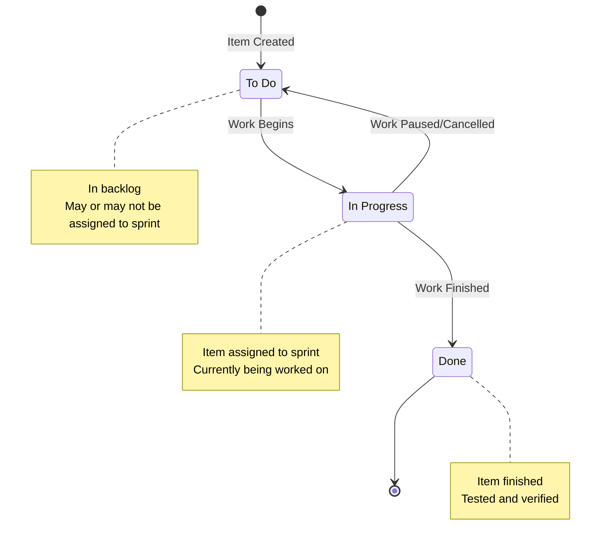
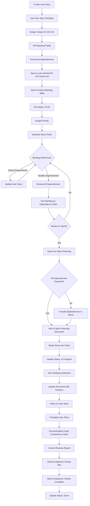
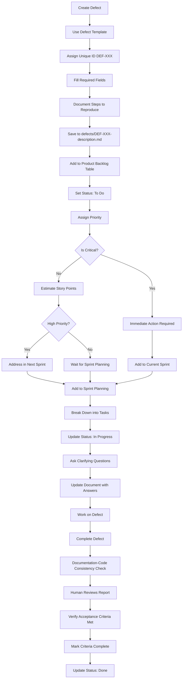

# Backlog Management Process

## Overview

This document defines the process for managing the product backlog, including how items are added, updated, prioritized, and linked to sprint planning.

**Related**: [Product Backlog Structure](product-backlog-structure.md), [Sprint Planning Template](../templates/sprint-planning-template.md)

## Backlog Lifecycle

### Status Lifecycle

```
⭕ To Do → ⏳ In Progress → ✅ Done
```

**Status Definitions**:
- **⭕ To Do**: In backlog; may or may not be assigned to a sprint. No work has begun.
- **⏳ In Progress**: Work has started (e.g. first task in progress). Assigned to active sprint.
- **✅ Done**: All acceptance criteria met; Documentation-Code Consistency Check run; human approved.

### Status Lifecycle Diagram

The following diagram visualizes the status transitions for backlog items:



## Adding Items to Backlog

### User Story Process

1. **Create User Story**:
   - Use user story template
   - Assign unique ID (US-XXX or your ID format)
   - Fill in all required fields
   - Save to `user-stories/[ID]-story-name.md`

2. **Add to Main Backlog**:
   - Add entry to product backlog table in `product-backlog.md`
   - Set initial status: ⭕ To Do
   - Assign priority based on business value
   - Estimate story points

3. **Backlog Refinement**:
   - Review during backlog refinement session
   - Clarify requirements if needed
   - Update priority if needed
   - Break down into tasks if large

#### User Story Workflow Diagram

The following diagram shows the complete workflow for user stories from creation to completion:



### Defect Process

1. **Create Defect**:
   - Use defect template
   - Assign unique ID (DEF-XXX or your ID format)
   - Fill in all required fields including steps to reproduce
   - Save to `defects/[ID]-defect-description.md`

2. **Add to Main Backlog**:
   - Add entry to product backlog table
   - Set initial status: ⭕ To Do
   - Assign priority (defects are often high priority)
   - Estimate story points

3. **Immediate Action**:
   - Critical defects may need immediate attention
   - High priority defects should be addressed in next sprint
   - Medium/Low priority defects can wait for sprint planning

#### Defect Workflow Diagram

The following diagram shows the complete workflow for defects from creation to completion, including decision points for critical defects:



## Updating Backlog Items

### When Work Begins

**Status Change**: ⭕ To Do → ⏳ In Progress

**Actions**:
1. Update status in user story/defect file
2. Update status in main backlog table
3. Add "Assigned Sprint" field
4. Add entry to sprint planning document
5. Update "Updated" date
6. If AI-assisted: AI asks clarifying questions to the user before starting implementation
7. If AI-assisted: AI updates the user story/defect document with user answers before starting implementation

**Example**:
```markdown
**Status**: ⏳ In Progress  
**Assigned Sprint**: Sprint 1  
**Updated**: 2024-01-15

## History
- 2024-01-10 - Created
- 2024-01-15 - Status changed to ⏳ In Progress, Assigned to Sprint 1
```

### Clarifying Questions Before Work

**Mandatory gate (AI-assisted work)**: Before the AI begins implementing a user story or defect, it must ask the user clarifying questions to ensure it understands the task. This step applies when work is AI-assisted.

**Process**:
1. AI reviews the user story or defect document
2. AI identifies ambiguities, missing details, or scope questions
3. AI asks the user clarifying questions (in chat or comment)
4. AI waits for the user to answer before implementing
5. AI updates the user story/defect document with the user's answers in the "Clarifying Questions" section
6. AI proceeds with implementation only after the document is updated

**For User Stories**: Questions may cover scope, edge cases, technical preferences, UX details, or unclear acceptance criteria.

**For Defects**: Questions may cover reproduction environment, expected vs actual behavior nuances, priority of fix approach, or steps to reproduce.

### Documentation-Code Consistency Check

**Mandatory gate (AI-assisted work)**: When the AI considers work done, it must run the Documentation-Code Consistency Check before the user commits. The human must review the gap report before status can move to Done.

**Process**:
1. AI reads [doc-code-consistency-process.md](doc-code-consistency-process.md)
2. AI compares code with documentation; generates gap report (out of date, contradictions, illogical statements)
3. Code is the source of truth
4. AI presents report to human
5. Human decides what to keep and what to update
6. AI updates documentation only per human direction
7. Commit proceeds only after human approval

### Acceptance Criteria Verification

**Mandatory gate**: Before an item can be marked as Done, all acceptance criteria must be verified as met. This step is required for both user stories and defects.

**Process**:
1. Open the user story or defect file
2. Review each acceptance criterion (or for defects: Expected Behavior, Testing Checklist)
3. Confirm each criterion is met by testing or inspection
4. If any criterion is not met, continue work until all are satisfied
5. Only when all criteria are met, proceed to mark complete and update status

**For User Stories**:
- Review each item in the "Acceptance Criteria" section
- Mark each as `[x]` in the item file only after confirming it is met

**For Defects**:
- Confirm Actual Behavior now matches Expected Behavior
- Complete all items in the "Testing" checklist (unit test, integration test, manual testing, etc.)

### When Work Completes

**Status Change**: ⏳ In Progress → ✅ Done

**Definition of Done**: All items must satisfy the criteria in [definition-of-done.md](../criteria/definition-of-done.md) before being marked Done.

**Actions** (in order):
1. Run Documentation-Code Consistency Check (see [doc-code-consistency-process.md](doc-code-consistency-process.md)); human reviews report and approves
2. Verify all acceptance criteria met (see Acceptance Criteria Verification above)
3. Mark acceptance criteria as complete in the item file
4. Update status in user story/defect file
5. Update status in main backlog table
6. Update sprint planning document (mark story as complete)
7. Add completion notes
8. Update "Updated" date

**Example**:
```markdown
**Status**: ✅ Done  
**Updated**: 2024-01-22

## History
- 2024-01-10 - Created
- 2024-01-15 - Status changed to ⏳ In Progress, Assigned to Sprint 1
- 2024-01-22 - Status changed to ✅ Done
```

## Backlog Refinement

### Refinement Sessions

**Frequency**: Weekly or bi-weekly (adjust to your team's needs)

**Participants**: Product Owner, Scrum Master, Development Team

**Agenda**:
1. Review new backlog items
2. Clarify requirements for unclear items
3. Estimate story points for unestimated items
4. Identify and document dependencies
5. Sort backlog by dependency order
6. Prioritize items
7. Break down large items
8. Remove obsolete items

### Refinement Checklist

For each backlog item:

- [ ] Description is clear and complete
- [ ] User story is well-defined (As a... I want... So that...)
- [ ] Acceptance criteria are specific and testable
- [ ] Story points are estimated (Fibonacci: 1, 2, 3, 5, 8, 13)
- [ ] Priority is assigned (🔴 Critical / 🟠 High / 🟡 Medium / 🟢 Low)
- [ ] Technical references are included
- [ ] Dependencies are identified
- [ ] Business value is documented

## Dependency Management

### Identifying Dependencies

Dependencies should be documented in each backlog item's "Dependencies" section. Common dependency types include:

- **Blocking Dependencies**: Item A must be completed before Item B can start
- **Enabling Dependencies**: Item A makes Item B easier or better, but not strictly required
- **Technical Dependencies**: Item A requires specific technical infrastructure from Item B
- **Data Dependencies**: Item A requires data structures or APIs from Item B
- **Functional Dependencies**: Item A builds upon functionality in Item B

### Sorting Backlog by Dependencies

**Process**:
1. **Review All Dependencies**: Go through each backlog item and verify dependencies are documented
2. **Create Dependency Graph**: Map out which items depend on which other items
3. **Identify Dependency Chains**: Find items that have no dependencies (can start immediately)
4. **Order by Dependency**: Sort backlog so items with dependencies come after their prerequisites
5. **Resolve Circular Dependencies**: If circular dependencies exist, break them by:
   - Combining items if they're tightly coupled
   - Splitting items to remove the circular dependency
   - Identifying a minimal implementation that breaks the cycle

**Sorting Rules**:
- Items with no dependencies should be at the top (ready to start)
- Items that depend on completed items should come next
- Items with uncompleted dependencies should be lower in the backlog
- Within the same dependency level, sort by priority (Critical → High → Medium → Low)

**Example Dependency Ordering**:
```
1. US-001: User Authentication (no dependencies) - 🔴 Critical
2. US-002: User Profile (depends on US-001) - 🟠 High
3. US-003: User Settings (depends on US-002) - 🟡 Medium
4. US-004: Advanced Features (depends on US-001, US-002) - 🟠 High
```

### Dependency Sorting Checklist

- [ ] All dependencies are documented in backlog items
- [ ] Dependency graph is created and reviewed
- [ ] Items are sorted so prerequisites come first
- [ ] Circular dependencies are identified and resolved
- [ ] Backlog table is updated to reflect dependency order
- [ ] Items with blocked dependencies are clearly marked

## Prioritization Process

### Prioritization Criteria

1. **Business Value**: How important is this to users?
2. **Technical Risk**: How risky is the implementation?
3. **Dependencies**: What other work depends on this? (Items with no dependencies are prioritized first)
4. **Effort**: How much work is required?
5. **Urgency**: How time-sensitive is this?

**Note**: After sorting by dependencies, prioritize within each dependency level using the criteria above.

### Priority Assignment

**🔴 Critical**:
- Blocks core functionality
- Security issues
- Data loss risks
- Must be addressed immediately

**🟠 High**:
- Important features for MVP
- Significant user value
- Should be addressed in next 1-2 sprints

**🟡 Medium**:
- Nice to have features
- Moderate user value
- Can wait for future sprints

**🟢 Low**:
- Future considerations
- Low user value
- Can be deferred indefinitely

## Linking to Sprint Planning

### Definition of Ready (Gate Before Sprint Selection)

Before items can be selected for a sprint, they must meet the [Definition of Ready](../criteria/definition-of-ready.md). This ensures items are sufficiently refined and will not block the sprint.

### Sprint Planning Process

**Step-by-step process**: See [sprint-planning-process.md](sprint-planning-process.md) for the full sprint planning process (Definition of Ready gate, capacity check, dependency ordering, task breakdown, sprint document creation).

## Sprint Retrospective

The Sprint Retrospective is held at the end of every sprint to inspect how the last sprint went and agree on improvements for the next one.

**Step-by-step process**: See [sprint-retrospective-process.md](sprint-retrospective-process.md) for a clear 8-step guide (schedule, prepare, run session, capture output, follow-up).

**Output**: Use the [Retrospective Output Template](../templates/retrospective-template.md) to capture results and add them to the sprint document's "Sprint Retrospective Notes" section.

## Backlog Maintenance

### Regular Updates

**Daily**:
- Update status of in-progress items
- Add notes on progress

**Weekly**:
- Review backlog during refinement
- Update dependencies as needed
- Re-sort backlog by dependency order
- Update priorities if needed
- Remove obsolete items

**Sprint End**:
- Mark done items as ✅ Done
- Review incomplete items
- Move incomplete items to next sprint or back to backlog
- **Conduct Sprint Retrospective (Retro Session)**: Identify improvements for the next sprint

### Backlog Cleanup

**Remove Items**:
- Obsolete features (no longer needed)
- Duplicate items
- Items that have been replaced

**Archive Items**:
- Done items (keep for reference)
- Cancelled items (document why)

## Backlog Metrics

Run `./project-management/scripts/backlog-metrics.sh` to compute backlog health metrics.

### Tracking Metrics

**Backlog Size**:
- Total number of items
- Items by priority
- Items by status

**Velocity Tracking**:
- Story points completed per sprint
- Average velocity
- Velocity trends

**Cycle Time**:
- Time from creation to completion
- Time in each status

**Aging**:
- Days since creation for To Do items
- Run `backlog-metrics.sh` to see aging per item
- **Aging thresholds**: See [backlog-aging-standards.md](backlog-aging-standards.md) for defaults (Critical: 3 days, High: 7 days, Medium: 14 days, Low: 30 days)

### Reporting

**Sprint Review**:
- Show completed items
- Show backlog status
- Discuss upcoming items

**Stakeholder Updates**:
- High-priority items status
- Upcoming features
- Blocked items

## Best Practices

### Writing Good Backlog Items

1. **Clear Description**: What needs to be done?
2. **User Story Format**: As a... I want... So that...
3. **Acceptance Criteria**: Specific, testable criteria
4. **Technical References**: Link to relevant documents
5. **Business Value**: Why is this important?

### Managing Backlog

1. **Keep It Updated**: Regular refinement and updates
2. **Sort by Dependencies**: Always maintain dependency order
3. **Prioritize Regularly**: Review priorities frequently (within dependency levels)
4. **Break Down Large Items**: Keep items manageable
5. **Document Decisions**: Record why items are prioritized
6. **Communicate Changes**: Keep team informed

## References

- **Product Backlog Structure**: [product-backlog-structure.md](product-backlog-structure.md)
- **Sprint Planning Process**: [sprint-planning-process.md](sprint-planning-process.md)
- **Sprint Planning Template**: [../templates/sprint-planning-template.md](../templates/sprint-planning-template.md)
- **User Story Template**: [../templates/user-story-template.md](../templates/user-story-template.md)
- **Defect Template**: [../templates/defect-template.md](../templates/defect-template.md)
- **Definition of Done**: [../criteria/definition-of-done.md](../criteria/definition-of-done.md)
- **Definition of Ready**: [../criteria/definition-of-ready.md](../criteria/definition-of-ready.md)
- **Release Notes Process**: [release-notes-process.md](release-notes-process.md)
- **Documentation-Code Consistency Process**: [doc-code-consistency-process.md](doc-code-consistency-process.md)
- **Architecture Decision Records**: [../architecture-decision-records/README.md](../architecture-decision-records/README.md)
- **Backlog Aging Standards**: [backlog-aging-standards.md](backlog-aging-standards.md)
- **Sprint Planning Process**: [sprint-planning-process.md](sprint-planning-process.md)
- **Sprint Retrospective Process**: [sprint-retrospective-process.md](sprint-retrospective-process.md)
- **Technical Debt Identification Process**: [technical-debt-identification-process.md](technical-debt-identification-process.md)

---

**Last Updated**: 2026-03-06  
**Version**: 1.0  
**Status**: Backlog Management Process Complete

