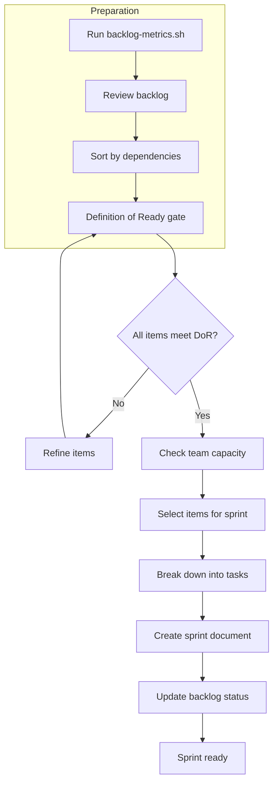

# Sprint Planning Process

**Purpose**: First-class process for planning sprints. Run at the start of each sprint, after the retrospective. Ensures items meet Definition of Ready, fit team capacity, and are properly broken down into tasks.

**Related**: [Sprint Planning Template](../templates/sprint-planning-template.md), [Definition of Ready](../criteria/definition-of-ready.md), [Backlog Management Process](backlog-management-process.md), [Sprint Retrospective Process](sprint-retrospective-process.md), [ADR-002: Branching Strategy](../architecture-decision-records/ADR-002-branching-strategy.md)

---

## When to Run

- **Timing**: Start of sprint, after sprint retrospective and before development begins
- **Duration**: 1–2 hours (adjust for team size and backlog size)
- **Participants**: Product Owner, Scrum Master, Development Team
- **Prerequisite**: Previous sprint retrospective completed; backlog refined and sorted by dependencies

---

## Sprint Planning Flow Diagram

---

## Step-by-Step Process

### Step 1: Prepare

- [ ] Run `./project-management/scripts/backlog-metrics.sh` to review backlog health
- [ ] Ensure backlog is sorted by dependencies (per [Backlog Management Process](backlog-management-process.md))
- [ ] Review retrospective improvements from previous retrospective; add to sprint if applicable
- [ ] Have [Sprint Planning Template](../templates/sprint-planning-template.md) ready

### Step 2: Definition of Ready Gate

Before selecting any item for the sprint, verify it meets [Definition of Ready](../criteria/definition-of-ready.md):

- [ ] Acceptance criteria are specific and testable
- [ ] Dependencies are identified and resolved (or in same sprint)
- [ ] Story points estimated (Fibonacci: 1, 2, 3, 5, 8, 13)
- [ ] No open clarifying questions
- [ ] Technical references included
- [ ] Priority assigned

Items that do not meet DoR must be refined before selection.

### Step 3: Capacity and Velocity Check

- [ ] Determine team velocity (from last sprint or historical average)
- [ ] Calculate available capacity for this sprint (velocity minus known absences, meetings)
- [ ] Set sprint goal (clear, measurable outcome)

### Step 4: Select Items for Sprint

- [ ] Select items in dependency order (items with completed dependencies first)
- [ ] Within same dependency level, sort by priority (Critical → High → Medium → Low)
- [ ] Ensure total story points do not exceed capacity
- [ ] For each selected item, verify all dependencies are either:
  - Already completed
  - Included in the same sprint
  - Planned for earlier sprints

### Step 5: Break Down into Tasks

- [ ] For each selected item, break down into actionable tasks
- [ ] Each task: specific, actionable, testable, referenced, estimated
- [ ] Add technical references (class/method, document, section)
- [ ] Assign story points to tasks if using task-level estimation

### Step 6: Create Sprint Document

- [ ] Copy [Sprint Planning Template](../templates/sprint-planning-template.md)
- [ ] Save as `sprints/sprint-XX-sprint-name.md`
- [ ] Fill in sprint header (goal, duration, velocity, dates)
- [ ] Add user stories with tasks
- [ ] Add sprint summary (total points, burndown placeholder)

### Step 6b: Create Feature Branches

Per [ADR-002: Branching Strategy](../architecture-decision-records/ADR-002-branching-strategy.md), create one feature branch per user story when starting work:

- [ ] For each user story in the sprint: `git checkout -b feature/US-XXX-short-description`
- [ ] Work and commit on the feature branch; open a PR to `main` when the story is complete

### Step 7: Update Backlog

- [ ] Change status of selected items to ⏳ In Progress
- [ ] Add sprint assignment to each item in product backlog table
- [ ] Update "Updated" date

---

## Checklist Summary

| Step | Action |
|------|--------|
| 1 | Run backlog-metrics, review backlog, sort by dependencies |
| 2 | Verify all selected items meet Definition of Ready |
| 3 | Check capacity and velocity; set sprint goal |
| 4 | Select items in dependency and priority order |
| 5 | Break down into tasks with technical references |
| 6 | Create sprint document from template |
| 6b | Create feature branch per user story when starting work (ADR-002) |
| 7 | Update backlog status to In Progress |

---

## Integration with Other Processes

- **Backlog Management**: Items must be in backlog and sorted by dependencies before sprint planning
- **Sprint Retrospective**: Run retrospective before planning next sprint; retrospective improvements may be added to sprint
- **Definition of Done**: All sprint items must satisfy DoD before marked Done

---

**Last Updated**: 2026-03-07
