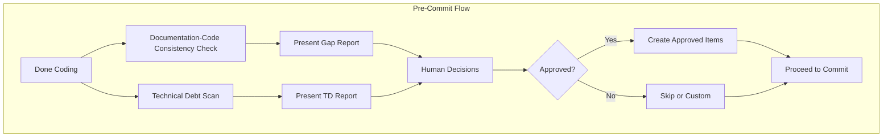

# Technical Debt Identification Process

**Purpose**: LLM-driven process for identifying, capturing, and documenting technical debt. The AI scans the codebase, identifies debt, and creates TD-XXX backlog items.

**Related**: [Technical Debt Template](../templates/technical-debt-template.md), [Product Backlog Structure](product-backlog-structure.md), [Backlog Management Process](backlog-management-process.md), [Documentation-Code Consistency Process](doc-code-consistency-process.md)

---

## LLM-Driven Process (Primary)

**When to run**: When the AI thinks it is done coding, it must run the Technical Debt Identification Scan before the user commits. This runs alongside the [Documentation-Code Consistency Check](doc-code-consistency-process.md).

### Pre-Commit Flow Diagram



### Step 1: Scan the Codebase

The AI scans:
- **Changed files** (from `git diff` or staged changes)
- **Related files** (imports, dependencies, same module)
- **Project root** (package.json, requirements.txt, config files for dependency debt)

### Step 2: Identify Technical Debt

Look for these categories and signals:

| Category | What to Look For |
|----------|------------------|
| **Code debt** | Duplication (DRY violations), long functions, deep nesting, magic numbers, unclear naming, commented-out code |
| **Architecture debt** | Tight coupling, circular dependencies, god objects, mixed concerns |
| **Documentation debt** | Missing docstrings, outdated comments, no README for module |
| **Dependency debt** | Outdated versions, known vulnerabilities, deprecated APIs |
| **Test debt** | Missing tests for new code, brittle tests, low coverage in changed areas |

### Step 3: Create TD-XXX Items

For each item identified:
1. Determine next available TD-XXX (scan `backlog/technical-debt/` for existing IDs)
2. Create file: `backlog/technical-debt/TD-XXX-short-description.md` using the [Technical Debt Template](../templates/technical-debt-template.md)
3. Fill in: Description, Impact, Proposed Solution, Technical References (file paths, line numbers)
4. Assign priority based on impact (Critical/High/Medium/Low)
5. Estimate story points (Fibonacci: 1, 2, 3, 5, 8, 13)

### Step 4: Add to Product Backlog

- Add TD-XXX to the product backlog table (Technical Debt section)
- If no Technical Debt section exists, add one following the User Stories / Defects format

### Step 5: Present Report to Human

Generate a **Technical Debt Report**:

```markdown
## Technical Debt Report - [Date]

### Items Identified

| ID | Description | Location | Priority | Points |
|----|-------------|----------|----------|--------|
| TD-001 | [Description] | [file:line] | Medium | 2 |
| TD-002 | [Description] | [file:line] | Low | 1 |

### Human Decisions
- [ ] Create all items in backlog
- [ ] Create only High/Critical items
- [ ] Skip (no action)
- [ ] Custom: [user direction]
```

Present the report. The human decides which items to keep. The AI creates only the TD-XXX files and backlog entries that the human approves.

### Integration with Pre-Commit Flow

When the AI is done coding:
1. Run [Documentation-Code Consistency Check](doc-code-consistency-process.md)
2. Run **Technical Debt Identification Scan** (this process)
3. Present both reports to the human
4. Proceed to commit only after human approval of both

---

## What Is Technical Debt?

Technical debt is the implied cost of rework caused by choosing a quick or limited solution now instead of a better approach that would take longer. It includes:

- **Code debt**: Duplication, poor structure, outdated patterns, missing tests
- **Architecture debt**: Design decisions that limit scalability or maintainability
- **Documentation debt**: Outdated or missing docs
- **Dependency debt**: Outdated libraries, security vulnerabilities
- **Test debt**: Missing or brittle tests, low coverage

---

## When to Identify Technical Debt

### Triggers

- **During development**: When you take a shortcut or defer a proper fix
- **During code review**: When reviewers notice quality issues
- **During sprint retrospective**: When the team discusses what slowed them down
- **During defect investigation**: When root cause reveals underlying design issues
- **During refactoring**: When touching code that needs broader cleanup
- **Periodic review**: Dedicated tech-debt review (e.g., quarterly or before major release)

### Signals

- "We should refactor this later"
- "This is a hack, but it works"
- "I don't want to touch this code"
- Repeated defects in the same area
- Slow or brittle tests
- Outdated dependencies with known issues

---

## Step-by-Step Identification Process

### Step 1: Recognize Technical Debt

- [ ] Notice a shortcut, workaround, or quality issue during work
- [ ] Or schedule a tech-debt review session
- [ ] Ask: "Would fixing this properly take more time than we have now?" If yes, it may be debt

### Step 2: Assess Impact

- [ ] **Impact**: What risks or costs does this impose? (maintenance burden, defects, slower development)
- [ ] **Scope**: What code, files, or areas are affected?
- [ ] **Urgency**: Is it blocking work or causing incidents? (Critical/High) Or merely inconvenient? (Medium/Low)

### Step 3: Capture the Item

- [ ] Use the [Technical Debt Template](../templates/technical-debt-template.md)
- [ ] Assign ID: TD-XXX (next available number)
- [ ] Fill in: Description, Impact, Proposed Solution, Technical References
- [ ] Save to: `backlog/technical-debt/TD-XXX-description.md` (create `technical-debt/` if needed)
- [ ] Add entry to product backlog table (Technical Debt section)

### Step 4: Prioritize

- [ ] Assign priority (🔴 Critical / 🟠 High / 🟡 Medium / 🟢 Low)
- [ ] Estimate story points (Fibonacci: 1, 2, 3, 5, 8, 13)
- [ ] Consider: Does it block other work? Is it causing incidents? How much does it slow development?

### Step 5: Add to Backlog

- [ ] Add TD-XXX to product backlog table
- [ ] Sort by dependencies and priority (per [Backlog Management Process](backlog-management-process.md))
- [ ] Optionally assign to a sprint during sprint planning

---

## Priority Guidelines

| Priority | When to Use |
|----------|-------------|
| 🔴 Critical | Blocking core work, causing incidents, security risk |
| 🟠 High | Slowing development significantly, high maintenance cost |
| 🟡 Medium | Noticeable impact, should be addressed in next few sprints |
| 🟢 Low | Nice to fix, can be deferred |

---

## Alternative: Track as US-XXX

If you prefer not to use TD-XXX, track technical debt as a user story with a "Technical Debt" label or tag. Ensure the title and description make the debt nature clear (e.g., "US-042: Refactor UserService (Technical Debt)").

---

## Integration with Other Processes

- **Pre-commit (LLM)**: The AI runs this scan when done coding, alongside the Documentation-Code Consistency Check. See "LLM-Driven Process" above.
- **Sprint Retrospective**: The AI can run a broader scan (full codebase) when preparing for retrospective; capture items using this process
- **On demand**: User can ask: "Scan the codebase for technical debt and create TD-XXX items"

---

## Checklist Summary

| Step | Action |
|------|--------|
| 1 | Recognize debt (shortcut, workaround, quality issue) |
| 2 | Assess impact, scope, urgency |
| 3 | Capture using Technical Debt Template; save to backlog/technical-debt/ |
| 4 | Prioritize and estimate |
| 5 | Add to product backlog table |

---

**Last Updated**: 2026-03-06
