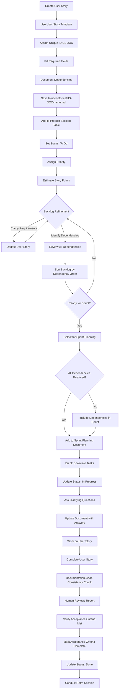
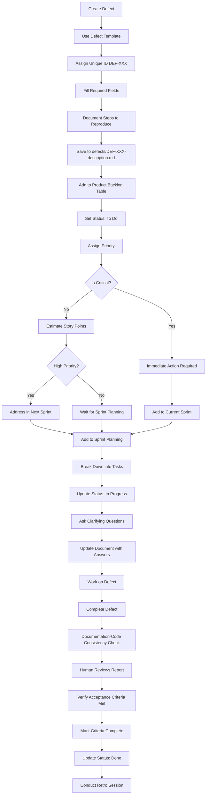
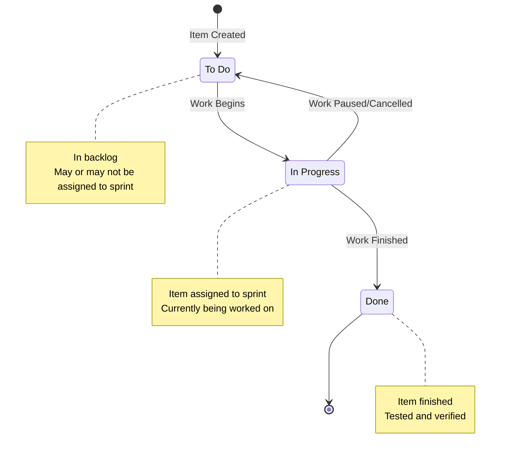
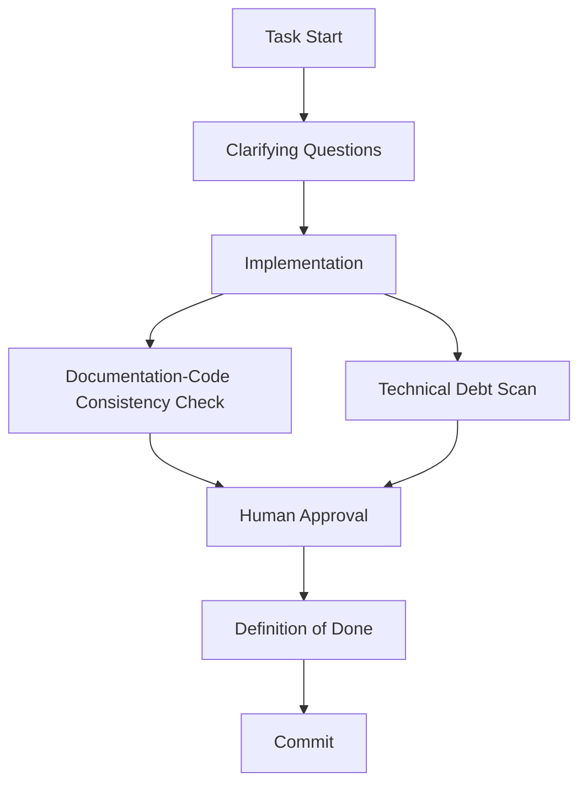

# Workflow Diagrams Example

This document demonstrates the Mermaid.js workflow diagrams used to visualize the backlog management process. These diagrams help team members understand how user stories and defects flow through the system.

## User Story Workflow

This flowchart shows the complete lifecycle of a user story from initial creation through backlog management to sprint planning and completion.

**Key Steps**:
1. Create user story using template and document dependencies
2. Add to product backlog with initial status
3. Go through backlog refinement including dependency identification
4. Sort backlog by dependency order
5. Verify item meets [Definition of Ready](../criteria/definition-of-ready.md)
6. Select for sprint planning (ensuring dependencies are resolved)
6. Break down into tasks, ask clarifying questions, update document with answers, then work on user story
7. Run Documentation-Code Consistency Check; human reviews report
8. Verify all acceptance criteria met, then mark complete and update status
9. Conduct sprint retrospective (retro session)

## Defect Workflow

This flowchart shows the complete lifecycle of a defect, including decision points for critical defects that require immediate attention.

**Key Decision Points**:
- **Critical Defects**: Require immediate action and are added to current sprint
- **High Priority Defects**: Should be addressed in next sprint
- **Medium/Low Priority Defects**: Can wait for regular sprint planning

## Status Lifecycle

This state diagram shows the status transitions for backlog items throughout their lifecycle.

**Status Definitions**:
- **⭕ To Do**: In backlog; may or may not be assigned to a sprint. No work has begun.
- **⏳ In Progress**: Work has started (e.g. first task in progress). Assigned to active sprint.
- **✅ Done**: All acceptance criteria met; Documentation-Code Consistency Check run; human approved.

## AI-Assisted Task Flow

End-to-end flow for AI-assisted work from task start to commit:

**Key steps**: Task start → clarifying questions → implementation → Documentation-Code Consistency + Technical Debt Identification Scan → human approval → Definition of Done → commit.

See [INDEX.md](../INDEX.md) for the full AI workflow and which files to attach for each task.

## How to Use These Diagrams

1. **Reference During Process**: Use these diagrams as quick reference when working with backlog items
2. **Onboarding**: Share with new team members to help them understand the workflow
3. **Process Improvement**: Use as a basis for discussing process improvements
4. **Documentation**: Include in process documentation to provide visual context

## Integration

These diagrams are integrated into:
- `project-management/processes/backlog-management-process.md` - Main process documentation
- User story template examples
- Sprint planning documentation

## Notes

- Diagrams use Mermaid.js syntax and render in most modern markdown viewers
- Diagrams should be updated if the process changes
- For best rendering, use markdown viewers that support Mermaid.js (GitHub, GitLab, VS Code with extensions, etc.)

